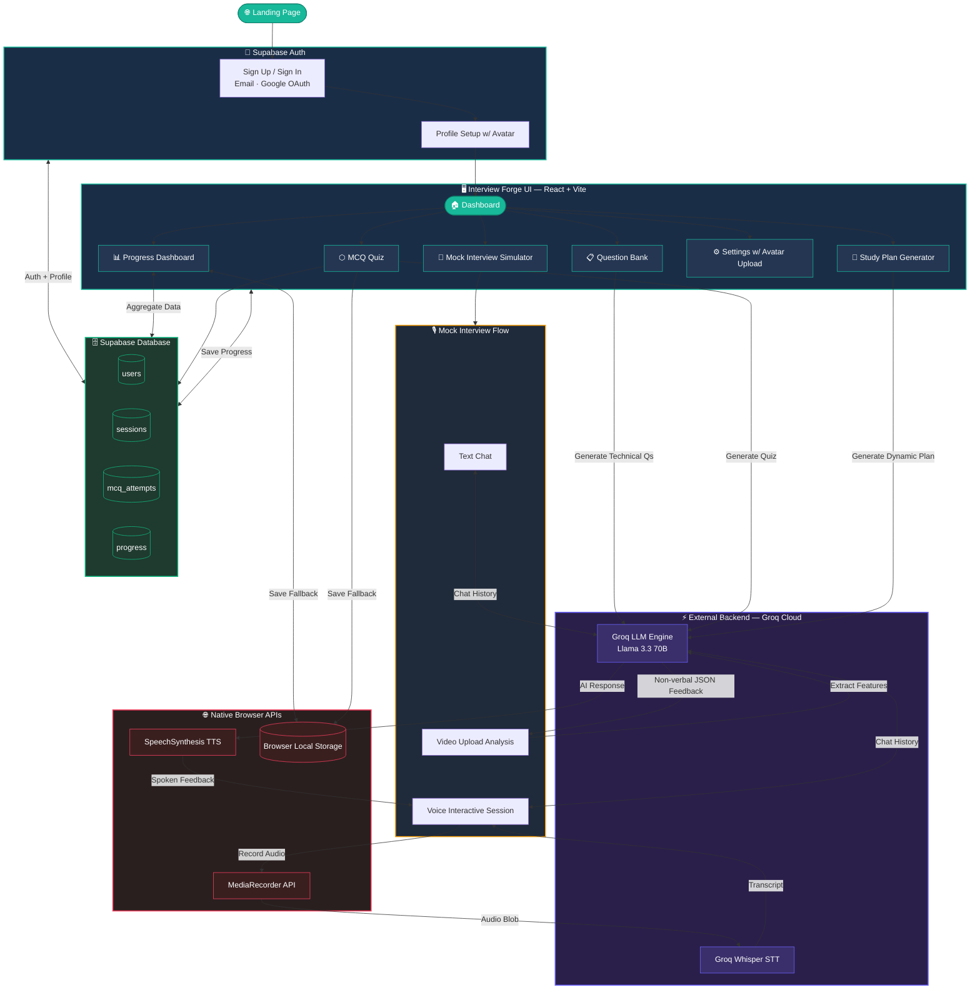

# Interview Forge — System Design

```mermaid
flowchart TD
    LP([🌐 Landing Page]) --> AU

    subgraph AUTH ["🔐 Supabase Auth"]
        AU[Sign Up / Sign In\nEmail · Google OAuth]
        PS[Profile Setup w/ Avatar]
    end

    AU --> PS --> DB

    subgraph CLIENT ["🖥️ Interview Forge UI — React + Vite"]
        DB([🏠 Dashboard])
        DB --> QB[📋 Question Bank]
        DB --> MCQ[⬡ MCQ Quiz]
        DB --> MI[🎤 Mock Interview Simulator]
        DB --> SP[📅 Study Plan Generator]
        DB --> PG[📊 Progress Dashboard]
        DB --> ST[⚙️ Settings w/ Avatar Upload]
    end

    subgraph AI ["⚡ External Backend — Groq Cloud"]
        LLM[Groq LLM Engine\nLlama 3.3 70B]
        STT[Groq Whisper STT]
    end

    subgraph MOCK ["🎙️ Mock Interview Flow"]
        TC[Text Chat]
        VI[Voice Interactive Session]
        VA[Video Upload Analysis]
    end

    subgraph BROWSER ["🌐 Native Browser APIs"]
        TTS[SpeechSynthesis TTS]
        MIC[MediaRecorder API]
        LS[(Browser Local Storage)]
    end

    subgraph STORE ["🗄️ Supabase Database"]
        direction LR
        T1[(users)]
        T2[(sessions)]
        T3[(mcq_attempts)]
        T4[(progress)]
    end

    %% AI calls
    QB -->|Generate Technical Qs| LLM
    MCQ -->|Generate Quiz| LLM
    SP -->|Generate Dynamic Plan| LLM
    MI --> MOCK

    %% Mock interview flows
    TC <-->|Chat History| LLM
    VI -->|Record Audio| MIC
    MIC -->|Audio Blob| STT
    STT -->|Transcript| VI
    VI <-->|Chat History| LLM
    LLM -->|AI Response| TTS
    TTS -->|Spoken Feedback| VI
    VA -->|Extract Features| LLM
    LLM -->|Non-verbal JSON Feedback| VA

    %% Storage
    AUTH <-->|Auth + Profile| STORE
    PG <-->|Aggregate Data| STORE
    PG <-->|Save Fallback| LS
    MCQ -->|Save Fallback| LS
    MCQ --> STORE
    CLIENT <-->|Save Progress| STORE

    style AUTH    fill:#1a2d47,stroke:#18b89a,stroke-width:2px,color:#fff
    style CLIENT  fill:#1a2d47,stroke:#18b89a,stroke-width:2px,color:#fff
    style AI      fill:#2a1f4a,stroke:#6c63ff,stroke-width:2px,color:#fff
    style MOCK    fill:#1f2a3a,stroke:#f59e0b,stroke-width:2px,color:#fff
    style BROWSER fill:#2a1f1f,stroke:#f43f5e,stroke-width:2px,color:#fff
    style STORE   fill:#1f3a2f,stroke:#10b981,stroke-width:2px,color:#fff

    classDef page    fill:#18b89a,stroke:#0f7d6a,color:#fff,stroke-width:1px
    classDef mod     fill:#243652,stroke:#18b89a,color:#fff,stroke-width:1px
    classDef groq    fill:#3a2f6a,stroke:#6c63ff,color:#fff,stroke-width:1px
    classDef browser fill:#3a1f1f,stroke:#f43f5e,color:#fff,stroke-width:1px
    classDef db      fill:#1f3a2f,stroke:#10b981,color:#fff,stroke-width:1px

    class LP,DB page
    class QB,MCQ,MI,SP,PG,ST mod
    class LLM,STT groq
    class TTS,MIC,LS browser
    class T1,T2,T3,T4 db
```
